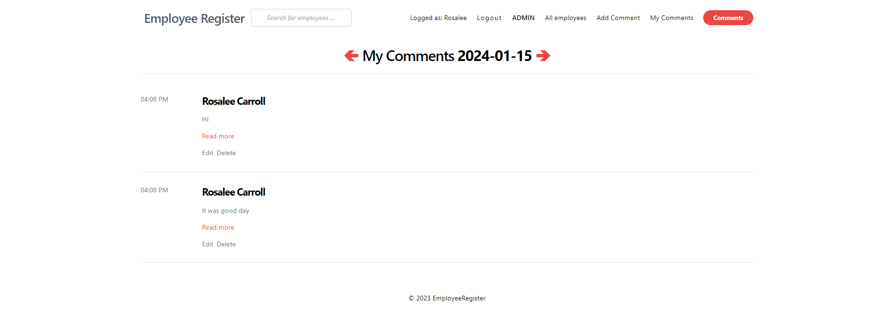

# laravel-RegisterEmployee - Employee Management Portal with Integrated Daily Commentary

**Web application, empowered by Laravel and styled with Tailwind CSS, serves as an all-encompassing employee management system with a unique twist-daily commentary. Aimed at streamlining administrative tasks and enhancing communication, this portal is the go-to solution for organizations seeking efficiency and engagement.**

**Core Features:**

1. **Employee Directory:** A robust database allowing for easy access to employee profiles, complete with search functionality to swiftly find information.
2. **Daily Commentary:** Employees can add comments tied to specific dates, promoting transparency and day-to-day insights into operations.
3. **Tiered Permission System:** Three distinct levels of access ensure secure and relevant interactions within the portal:
   - **Employee:** View personal information and add comments.
   - **Moderator:** Oversee comment sections and manage employee interactionswith limited administrative capabilities.
   - **Admin:** Full control over the portal, with the ability to manage all employees, moderators, and site content.
4. **Responsive Design:** Crafted with Tailwind CSS, the interface is fully responsive, ensuring a seamless experience across all devices and screen sizes.
5. **Real-Time Updates:** Stay informed with live updates, allowing employees and management to stay connected to the latest workplace developments and discussions.
6. **Intuitive User Interface:** The clean and organized layout, marked by clear timestamps and accessible 'Read more' options, makes navigation and content reading effortless.

## Screenshots

